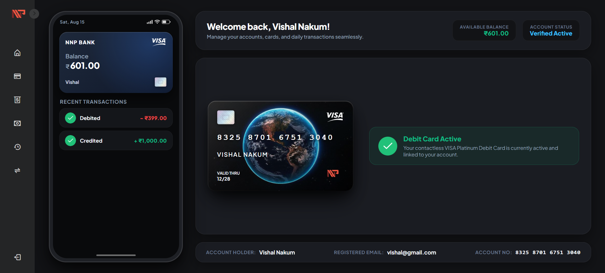
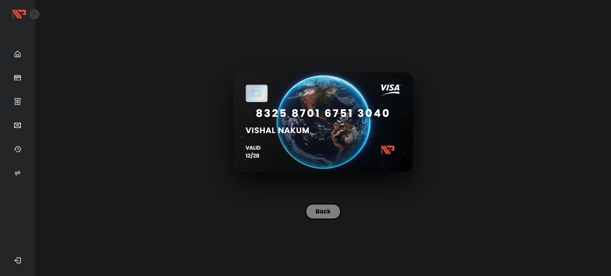
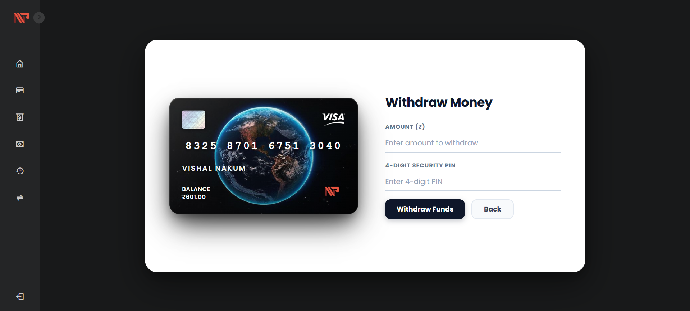
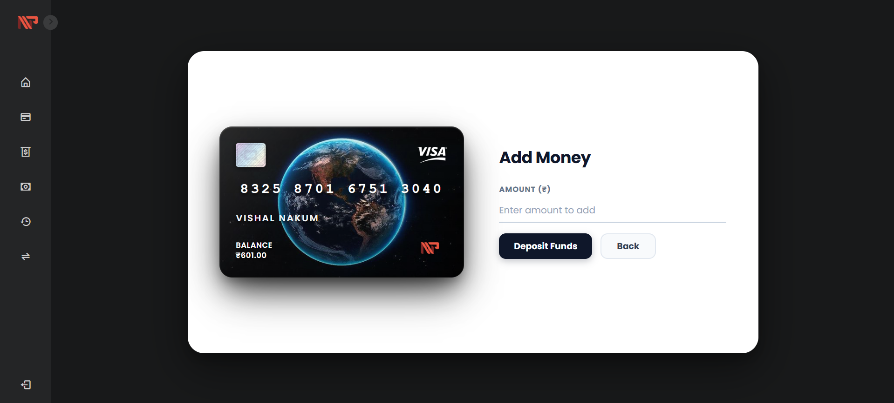
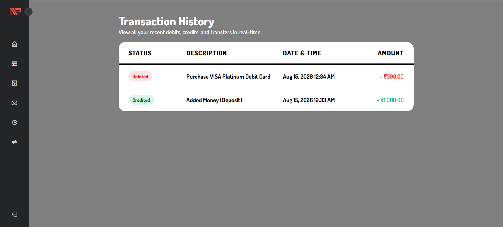
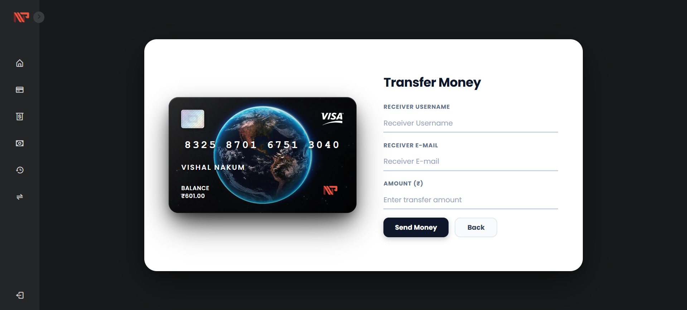

# 🏦 NNP Online Banking System

[](https://nnpbank.infinityfreeapp.com/)
[](https://www.php.net/)
[](https://www.mysql.com/)
[](https://developer.mozilla.org/en-US/docs/Web/JavaScript)
[](https://www.w3.org/Style/CSS/)

🔗 **Live Demo**: [https://nnpbank.infinityfreeapp.com/](https://nnpbank.infinityfreeapp.com/)

**NNP Online Banking** is a responsive, feature-rich web-based banking portal built with **PHP** and **MySQL**. It features an immersive dark-theme interface, an interactive mobile phone app simulator, interactive 3D holographic debit cards, real-time peer-to-peer transfers, deposit/withdrawal facilities, and a modular authentication system.

---

## 🌟 Key Features

### 🔐 Modular Authentication & Security
- **User Registration**: Secure account creation with age validation (18+), automated 16-digit account number generation, and 4-digit security PIN setup.
- **Secure Password Hashing**: Passwords stored using industry-standard `password_hash()` (Bcrypt).
- **Session Protection**: Session-based route protection across all dashboard pages.
- **Forgot Password Recovery**: OTP-based identity verification workflow for resetting account passwords.

### 📱 Live Smartphone Simulator & Dashboard
- **Embedded Phone Mockup**: Real-time smartphone simulator displaying current date, network status, account balance, and live recent transactions.
- **Debit Card Ordering**: In-app VISA Platinum Debit Card ordering system with instant account deduction and active card badge.
- **Personal Account Bar**: Quick view of verified user details, email address, and formatted bank account numbers.

### 💳 Interactive 3D Debit Card Demo
- **3D Tilt Micro-Interaction**: Gyroscopic 3D mouse-tracking tilt effect built with CSS 3D transforms and vanilla JavaScript.
- **Card Aesthetics**: Embedded metallic chip, NFC contactless emblem, VISA platinum branding, and dynamic cardholder embossing.

### 💸 Peer-to-Peer Fund Transfers
- **Instant Transfers**: Transfer money securely to any registered username and verified email.
- **Atomic Transactions**: Database operations execute inside atomic SQL transactions (`BEGIN TRANSACTION` / `COMMIT`) to prevent balance inconsistencies.
- **Double-Entry History**: Automatically logs debit records for senders and credit records for receivers.

### 💰 Deposits & Cash Withdrawals
- **Instant Deposit (Add Money)**: Credit funds into accounts with real-time balance refresh.
- **Secure Withdrawals**: PIN-protected debit withdrawals with automated balance verification.

### 📜 Complete Transaction Ledger
- **Transaction History**: Chronological log of debits and credits with color-coded status badges and formatted Indian Rupee (₹) amounts.

### 🌐 Network Connectivity Monitor
- **Offline Detection**: Real-time connectivity monitor that gracefully redirects to a dedicated offline recovery page when the connection is interrupted.

---

# 📸 Screenshots

## 🏠 Dashboard

The dashboard provides a complete overview of the user's bank account, including balance, account status, debit card status, and recent transactions.



---

## 💳 3D Interactive Debit Card Demo

The project includes a dedicated interactive VISA Platinum Debit Card demonstration featuring real-time 3D tilt effects, metallic chip, and cardholder details.



---

## 💸 Withdraw Money

The withdrawal page allows users to enter the withdrawal amount and verify the transaction using their 4-digit security PIN.



---

## 💰 Add Money

The Add Money page allows users to deposit funds into their bank account.



---

## 📊 Transaction History

The transaction history page displays all account debits and credits with their status, description, date, time, and amount.



---

## 🔄 Transfer Money

The transfer page allows users to send money to another registered user using their username, email, and transfer amount.



---

## 📂 Project Structure

```
bank/
    ├── assets/
    │   ├── css/                       # 11 CSS stylesheets
    │   └── images/                    # 10 Image assets & UI badges
    ├── auth/
    │   ├── forgot_password.php        # OTP password reset flow
    │   ├── login.php                  # User login
    │   ├── logout.php                 # Session termination
    │   └── register.php               # User registration
    ├── config/
    │   ├── db.php                     # MySQL connection
    │   └── internet_check.php         # Offline detector
    ├── database/
    │   └── schema.sql                 # Clean database schema & demo seed
    ├── includes/
    │   ├── functions.php              # Shared helper functions
    │   ├── mailer.php                 # Email helper
    │   └── sidebar.php                # Sidebar navigation
    ├── screenshots/                   # Project preview screenshots
    ├── add_money.php                  # Add funds page
    ├── card_demo.php                  # 3D debit card showcase
    ├── index.php                      # Main dashboard & phone simulator
    ├── no_connection.php              # Offline recovery screen
    ├── transactions.php               # Transaction history ledger
    ├── transfer.php                   # P2P money transfer
    ├── withdraw.php                   # Cash withdrawal
    └── README.md                      # GitHub documentation
```

---

## 🚀 Installation & Setup Guide

### 1. Prerequisites
Ensure you have the following installed on your machine:
- **[XAMPP](https://www.apachefriends.org/)** (or WampServer / LAMP / MAMP) with:
  - **PHP** 7.4, 8.0, 8.1, or 8.2+
  - **MySQL** 5.7+ or **MariaDB** 10.4+
  - **Apache** Web Server

---

### 2. Clone or Copy the Repository
Clone this repository directly into your web server's root directory (`htdocs` for XAMPP):

```bash
# Navigate to XAMPP htdocs directory
cd C:\xampp\htdocs

# Clone the repository
git clone https://github.com/<your-username>/bank.git
```

---

### 3. Start Apache & MySQL
1. Launch the **XAMPP Control Panel**.
2. Click **Start** for both **Apache** and **MySQL**.

---

### 4. Import the Database Schema
1. Open your browser and navigate to **[http://localhost/phpmyadmin](http://localhost/phpmyadmin)**.
2. Click **New** in the left sidebar and create a database named `bank`.
3. Select the `bank` database and open the **Import** tab.
4. Choose the schema file located at:
   ```
   database/schema.sql
   ```
5. Click **Import** (or **Go**).

*Alternatively, import via command line:*
```bash
mysql -u root -p bank < C:\xampp\htdocs\bank\database\schema.sql
```

---

### 5. Configure Database Connection (If Necessary)
If your local MySQL uses a custom password or port, edit [`config/db.php`](config/db.php):

```php
$server   = "localhost";
$username = "root";
$password = "";      // Enter your MySQL password if any
$database = "bank";
```

---

### 6. Launch the Application
Open your web browser and visit:
```
http://localhost/bank
```
You will be redirected to the secure login page (`auth/login.php`).

---

## 🛠️ Technology Stack

| Layer | Technologies Used |
| :--- | :--- |
| **Backend** | PHP 8.x (Procedural & OOP, Prepared Statements with MySQLi) |
| **Database** | MySQL / MariaDB (Relational schema, UTF-8 character encoding, Foreign Indexes) |
| **Frontend** | HTML5, Modern CSS3 (Flexbox, CSS Grid, 3D Transforms, Glassmorphism, CSS Variables) |
| **Interactivity** | Vanilla JavaScript (DOM Events, 3D Gyroscopic Card Tilt, Sidebar Toggling) |
| **Icons & Typography** | Boxicons, Google Fonts (*Plus Jakarta Sans*, *Inclusive Sans*, *Poppins*, *Dosis*) |

---

## 💡 Recommended Future Enhancements

Here are key architectural and security recommendations to take this banking project to enterprise production standards:

1. **🔒 CSRF Tokens (Cross-Site Request Forgery Protection)**:
   - Generate unique per-session CSRF tokens on sensitive forms (`transfer.php`, `withdraw.php`, `add_money.php`) and validate them upon submission.

2. **🛡️ PDO (PHP Data Objects) Database Layer**:
   - Migrate from `mysqli` to `PDO` for enhanced database portability, standardized exception handling, and robust parameter binding.

3. **✉️ Live 2FA (Two-Factor Authentication)**:
   - Integrate PHPMailer / Twilio API to dispatch 6-digit one-time verification passcodes (OTP) for high-value fund transfers and password resets.

4. **⚡ Rate Limiting & Account Lockout**:
   - Add failed login attempt thresholds (e.g., maximum 5 attempts within 15 minutes) to mitigate brute-force password cracking attacks.

5. **📄 PDF Statement Generation**:
   - Integrate a library such as `FPDF` or `Dompdf` to allow users to export customized account statements for tax or audit purposes.

6. **📱 Progressive Web App (PWA) Support**:
   - Add a `manifest.json` and a service worker to enable app-like offline caching and home-screen installation on mobile devices.

---

## 🤝 Contributing

Contributions, issues, and feature requests are welcome!

1. Fork the repository
2. Create your feature branch (`git checkout -b feature/AmazingFeature`)
3. Commit your changes (`git commit -m "Add some AmazingFeature"`)
4. Push to the branch (`git push origin feature/AmazingFeature`)
5. Open a Pull Request

---
